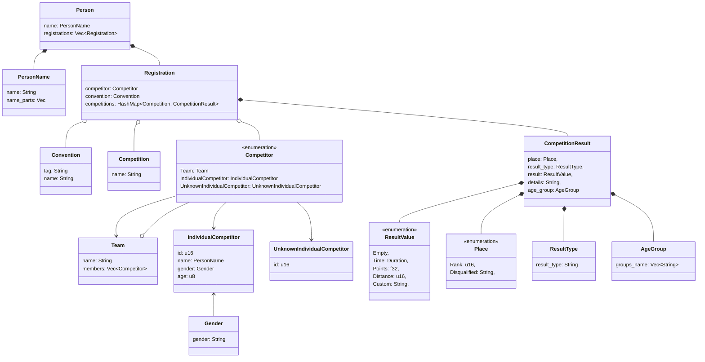

# UDA Results Extractor

# Required envs

The following env vars are required:

| Variable     | Definition                                               | Example             |
|--------------|----------------------------------------------------------|---------------------|
| UDA_USERNAME | Username of the account the data will be downloaded with | example@example.com |
| UDA_PASSWORD | Password of the account the data will be downloaded with | Th1s1sAPa55w0rd     |
| CONVENTIONS  | comma-separated list of conventions to extract from UDA  | unicon2020,cfm2023  |

These vars can be passed to the app through env
var (`UDA_USERNAME=<> UDA_PASSWORD=<> CONVENTIONS=<> uda-results-extractor`)
or using a `.env` file. The latter should be located in the execution folder.

# Required rights

In order to be able to export data from a convention, the user should have the following rights:

- event_planner
- competition_admin

If they don't have the rights, then the extractor will fail for that particular convention.
The other conventions will be handled though.

# Class diagram

