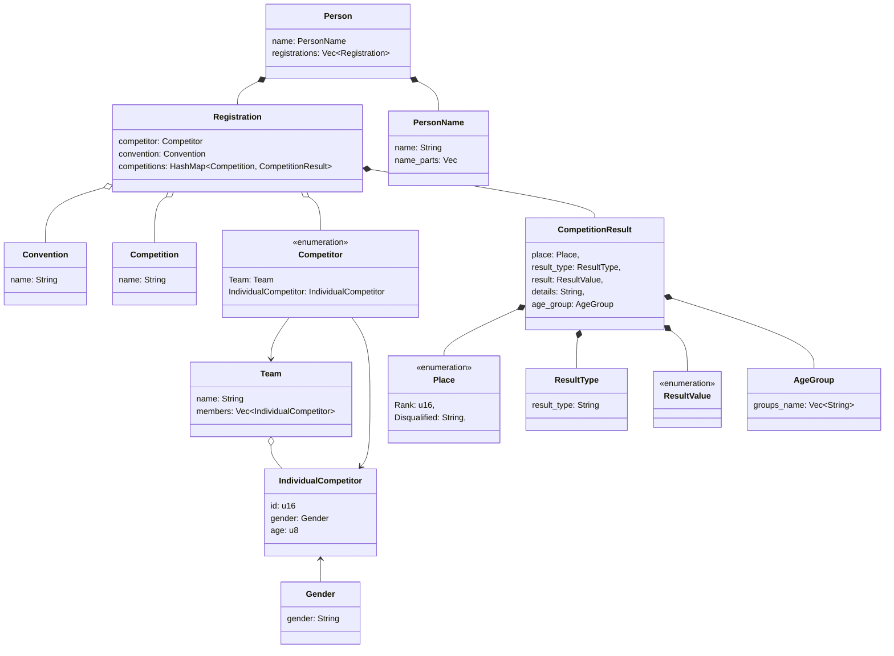

# UDA Results Extractor

```mermaid
classDiagram
    direction TD

    class Person {
        name: PersonName
        registrations: Vec~Registration~
    }

    class PersonName {
        name: String
    %% name_parts is for equality checks
        name_parts: Vec<String>
    }

    class Registration {
        competitor: Competitor
        convention: Convention
        competitions: HashMap~Competition, CompetitionResult~
    }

    class Convention {
        name: String
    }

    class Competition {
        name: String
    }

    class Competitor {
        <<enumeration>>
        Team: Team
        IndividualCompetitor: IndividualCompetitor
    }

    class Team {
        name: String
        members: Vec~IndividualCompetitor~
    }

    class IndividualCompetitor {
        id: u16
    %% gender and age depends on the competition, so can't be added to `Person`
        gender: Gender
        age: u8
    }

%%    note for Gender "Should be one of [Male, Female]"
    class Gender {
        gender: String
    }

    class ResultValue {
        <<enumeration>>
    %% FIXME
    }

%%    note for Place "If disqualified, should be one of [DNF, DQ]"
    class Place {
        <<enumeration>>
        Rank: u16,
        Disqualified: String,
    }

%%    note for ResultType "Should be one of [AgeGroup, Overall]"
    class ResultType {
        result_type: String
    }

    class AgeGroup {
    %% An age group may be in fact a gathering of multiple age groups
        groups_name: Vec~String~
    }

    class CompetitionResult {
        place: Place,
        result_type: ResultType,
        result: ResultValue,
        details: String,
        age_group: AgeGroup
    }

    Person *-- Registration
    Registration o-- Convention
    Registration o-- Competition
    Registration o-- Competitor
    Registration *-- CompetitionResult
    Person *-- PersonName
    Competitor --> Team
    Competitor --> IndividualCompetitor
    Team o-- IndividualCompetitor
    IndividualCompetitor <-- Gender
    CompetitionResult *-- Place
    CompetitionResult *-- ResultType
    CompetitionResult *-- ResultValue
    CompetitionResult *-- AgeGroup
```